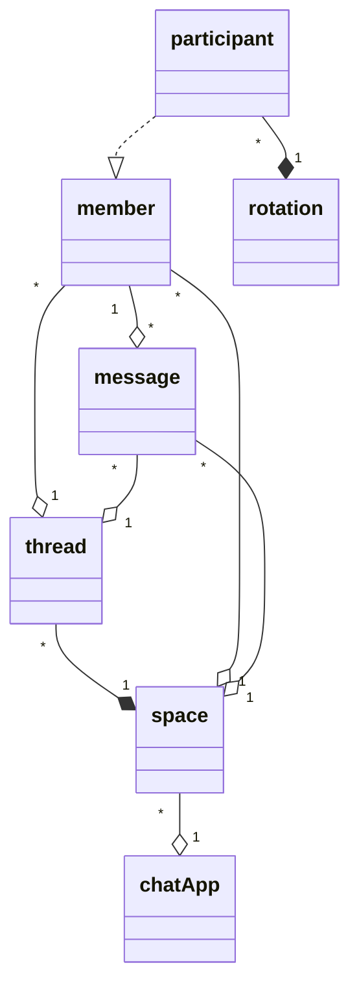

# Onebot Modeling

```mermaid
classDiagram
  space "*" --o "1" chatApp
  thread "*" --* "1" space
  member "*" --o "1" space
  member "*" --o "1" thread
  member "1" --o "*" message
  participant ..|> member
  message "*" --o "1" space
  message "*" --o "1" thread
  participant "*" --* "1" rotation
```
